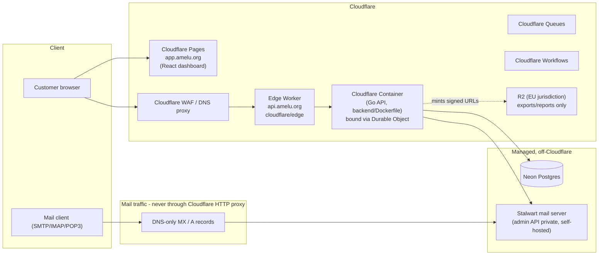
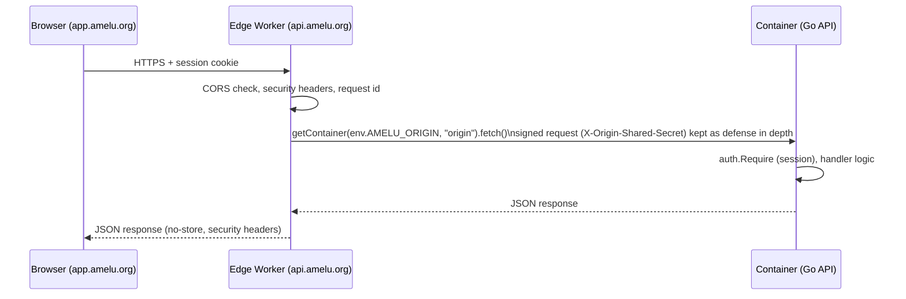
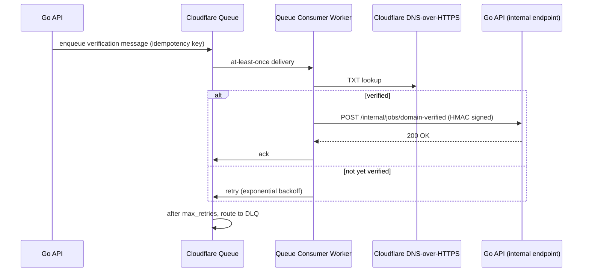
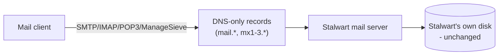

# Architecture

Last verified against Cloudflare documentation: 2026-07-15.

## Target picture

The Go API previously ran on a Hetzner VPS, reached via a private Cloudflare
Tunnel hostname, with Postgres self-hosted alongside it. Both moved onto
Cloudflare-adjacent managed platforms: the API is now a Cloudflare Container
bound directly to the edge Worker (no Tunnel hop), and Postgres is Neon. See
`TUNNEL.md` for the historical Tunnel setup, kept as a documented rollback
path.

## Request flow (customer dashboard action)

## Async job flow (domain verification example)

## Mail traffic (unaffected by this migration)

No Cloudflare product sits between a mail client and Stalwart. See
`DNS_AND_MAIL.md` for exactly which records are DNS-only vs. proxied.

## Components and where they run after this migration

| Component | Before | After |
|---|---|---|
| React dashboard | served by Vite/whatever static host | Cloudflare Pages |
| Go API | public HTTP listener, then Hetzner VPS behind a Cloudflare Tunnel | Cloudflare Container, bound directly to the edge Worker (no VPS, no Tunnel) |
| Postgres | self-hosted alongside the Go API | Neon (managed) |
| Stalwart mail server | public mail protocols, private admin API | unchanged - still self-hosted, admin API stays private |
| Mailbox expiration ticker | in-process Go goroutine | in-process by default; optional Worker Cron Trigger + Workflow via feature flag |
| Domain verification | synchronous live DNS check in a request handler | existing synchronous check unchanged; new async Queue-based path scaffolded for future adoption |
| Stalwart provisioning | synchronous in `CreateDomain` handler | unchanged; async Workflow designed, not adopted yet |
| CSV exports / reports / support bundles | not object-stored today | new: optional private R2 storage with signed URLs (see `R2_STORAGE.md`) |

## Why this shape

- **Worker in front of Go, not a rewrite**: the Go backend's routing,
  handlers, and Postgres access are untouched. The Worker's job is
  edge-level concerns (CORS, headers, health, request id) that don't belong
  in application code duplicated per-language.
- **Container instead of a public port**: removes the Go API's public
  attack surface entirely - it's only reachable through the edge Worker's
  own Durable Object binding (`cloudflare/edge/src/container.ts`), no
  listener to firewall or patch against internet scanning. Replaces the
  earlier Tunnel+VPS approach, which achieved the same goal at the cost of
  operating a separate VPS and `cloudflared` fleet.
- **Neon instead of self-hosted Postgres**: same reasoning - one less piece
  of infra to operate directly, managed backups/scaling. `backend/internal/
  db/db.go`'s `Open()` sets conservative pool limits (`SetMaxOpenConns`
  etc.) since Neon enforces a connection cap shared across every Container
  instance, unlike an unbounded local pool.
- **Queues/Workflows are additive, not required**: today's in-process ticker
  and synchronous provisioning keep working unmodified; the async paths are
  feature-flagged or simply not wired into the request path yet, so nothing
  about migrating to Cloudflare requires touching that behavior on day one.
- **R2 for exports only, not mail**: mailbox storage is Stalwart's domain
  expertise (retention, IMAP semantics, etc.) - re-implementing that on R2
  would be a rewrite of the mail server, not a migration.

## References

- Workers: https://developers.cloudflare.com/workers/
- Pages: https://developers.cloudflare.com/pages/
- Queues: https://developers.cloudflare.com/queues/
- Workflows: https://developers.cloudflare.com/workflows/
- R2: https://developers.cloudflare.com/r2/
- Cloudflare Tunnel: https://developers.cloudflare.com/cloudflare-one/connections/connect-networks/
- WAF: https://developers.cloudflare.com/waf/
- DNS: https://developers.cloudflare.com/dns/
