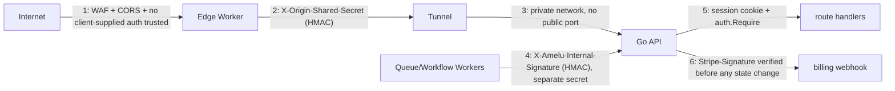

# Security

Last verified against Cloudflare documentation: 2026-07-15.

## Trust boundaries

1. **Internet -> Worker**: no trust. CORS restricts which browser origins
   can make credentialed requests; nothing about the request is otherwise
   assumed safe. A client-supplied `X-Origin-Shared-Secret` header is
   explicitly stripped before proxying (`STRIP_REQUEST_HEADERS` in
   `cloudflare/edge/src/proxy.ts`) so it can never be spoofed to skip layer 2.
2. **Worker -> Tunnel -> origin**: the Worker signs every proxied request
   (`ORIGIN_SHARED_SECRET`), verified by `handlers.EdgeAuth`. Proves the
   request passed through the Worker, not a direct hit on the tunnel
   hostname.
3. **Network isolation**: the Go API has no public listener at all - only
   `cloudflared`'s outbound tunnel connection reaches it. See `TUNNEL.md`.
4. **Queue/Workflow -> origin, direct**: these call the origin's
   `/internal/*` routes directly over the tunnel, bypassing the edge Worker
   entirely (so `EdgeAuth` explicitly exempts `/internal/`). Authenticated
   instead by `auth.RequireInternal` with a **separate** secret
   (`INTERNAL_JOBS_SHARED_SECRET`) - compromise of the edge Worker's secret
   doesn't grant access to internal job endpoints, and vice versa.
5. **Customer sessions**: unchanged from before this migration -
   `internal/auth`'s cookie-based sessions, hashed tokens, never stored in
   KV (safety rule #9).
6. **Stripe webhook**: unchanged - `webhook.ConstructEventWithOptions`
   verifies `Stripe-Signature` against the raw body before any event is
   read or acted on. The edge Worker's only involvement is forwarding the
   raw body byte-for-byte (`EDGE_WORKER.md` "Streaming and the raw Stripe
   body") - it never parses, buffers, or re-serializes it, so it cannot be
   the thing that breaks signature verification.

## Defense in depth, not defense in one layer

Layers 1-3 each independently prevent unauthorized origin access:

- If the tunnel hostname were somehow leaked/DNS-guessed, layer 2 (HMAC)
  still blocks unsigned requests.
- If the shared secret were somehow leaked, network isolation (layer 3)
  still means an attacker needs a route to the tunnel hostname at all,
  which nothing public has.
- If both failed, customer-facing state-changing routes still require a
  valid session (layer 5).

## What's explicitly never exposed

- Stalwart's admin API - only the Go origin ever calls it, over its own
  private network, unrelated to any Cloudflare product. See
  `internal/stalwart/client.go`.
- The Go API's HTTP port - no `0.0.0.0`-bound public listener in production;
  `cloudflared` is the only ingress.
- SMTP/IMAP/POP3/ManageSieve/MX - never touch Cloudflare's HTTP proxy at
  all, DNS-only records point straight at the mail server. See
  `DNS_AND_MAIL.md`.
- Any secret in this repository - every credential is `${PLACEHOLDER}` or a
  `.example` file; real values only exist in `wrangler secret`,
  GitHub Actions secrets, or `.dev.vars`/`.env` (gitignored). See
  `SECRETS.md`.

## What's logged and what's redacted

`cloudflare/edge/src/redact.ts` redacts `Authorization`, `Cookie`,
`Set-Cookie`, `X-Amelu-Internal-Signature`, `X-Origin-Shared-Secret`, and
`Stripe-Signature` before any `console.log`/`console.error` call in the
Worker - tested in `cloudflare/edge/test/unit.test.ts`. Request/response
bodies are never logged in full anywhere in this migration's new code (the
Worker never logs bodies at all; the Go origin's existing logging, unchanged
by this migration, doesn't log request bodies either).

## Rate limiting and abuse

Not implemented by this migration - Cloudflare's WAF/rate limiting rules
(dashboard-configured, not code in this repo) are the recommended layer for
this, applied at the zone level once DNS is cut over. Out of scope here
since it's a dashboard policy decision, not application code.

Reference: https://developers.cloudflare.com/waf/rate-limiting-rules/

## Reporting a concern about this migration's design

File an issue against `ordnary-com/amelu` describing the concern - nothing
in this migration changes the existing security contact process.
