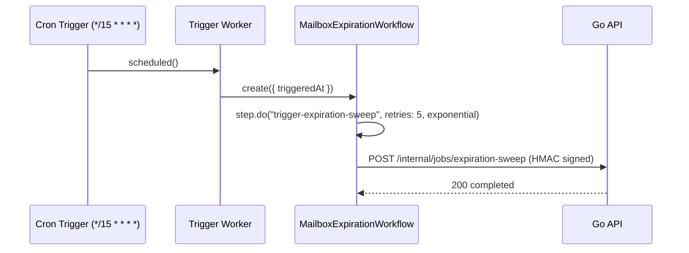
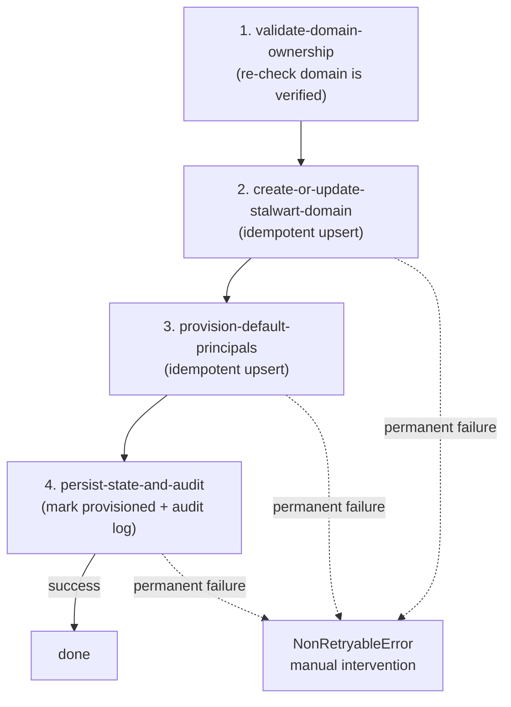

# Workflows

Last verified against Cloudflare documentation: 2026-07-15.

Source: `cloudflare/workflows/mailbox-expiration/`,
`cloudflare/workflows/stalwart-provisioning/`.

VERIFY AGAINST CURRENT DOCS before deploying either Workflow: the exact
`step.do()` config shape (`WorkflowStepConfig`) and `NonRetryableError`'s
import location (`cloudflare:workflows`, not `cloudflare:workers`) were
confirmed against the installed `@cloudflare/workers-types` package during
this migration, but the Workflows API has moved before and may again.

Reference: https://developers.cloudflare.com/workflows/

## Mailbox expiration

**Status: functional, off by default.** Today's in-process Go ticker
(`cmd/api/main.go`, 15-minute interval, calling `RunExpirationSweep`) stays
the default. This Workflow is a complete, working alternative path, gated
by a feature flag.

### Design



- `cloudflare/workflows/mailbox-expiration/src/index.ts`: Cron Trigger
  Worker (`triggers.crons` in `wrangler.jsonc`), creates one Workflow
  instance per tick.
- `cloudflare/workflows/mailbox-expiration/src/workflow.ts`:
  `MailboxExpirationWorkflow`, a single `step.do()` wrapping the signed call
  to `POST /internal/jobs/expiration-sweep`.
- `backend/internal/handlers/internal_jobs.go`:
  `RunExpirationSweepJob`, HMAC-authenticated
  (`auth.RequireInternal`/`INTERNAL_JOBS_SHARED_SECRET`), calls the
  existing `App.RunExpirationSweep` - the exact same function the in-process
  ticker calls.

### Idempotency

`RunExpirationSweep` was already idempotent before this migration: it
re-queries `ListExpiredMailboxes` every call, and each mailbox's action
(suspend or delete) is a no-op against Stalwart/Postgres once already
applied. Calling the endpoint twice for the same tick - expected under
Workflows' retry model and under Queues-style at-least-once semantics in
general - is safe by construction, not by added deduplication logic.

### Feature flag

`EXPIRATION_SWEEP_MODE` (Go env var, `backend/internal/config/config.go`):

- `ticker` (default) - in-process goroutine runs, this Workflow's calls (if
  deployed) are redundant but harmless.
- `external` - in-process goroutine disabled entirely; requires
  `INTERNAL_JOBS_SHARED_SECRET` to be set (fails startup otherwise, see
  `config.Load`). The Worker/Workflow above becomes the only trigger.

### Structured audit logging

Every sweep action already logs via `internal/handlers/expiration_job.go`'s
`a.Store.LogActivity(...)` calls (`mailbox.expired_deleted`,
`mailbox.expired_suspended`) - unchanged by this migration, since the
Workflow calls the same code path. `RunExpirationSweepJob` additionally logs
`"internal job: expiration sweep triggered externally"` so origin logs
distinguish ticker-triggered from Workflow-triggered sweeps.

### Disabling (documented rollback procedure)

Set `EXPIRATION_SWEEP_MODE=ticker` (or unset it - that's the default) and
restart the Go API. No data migration in either direction - see
`ROLLBACK.md`.

## Domain verification

See `QUEUES.md` - implemented as a Queue consumer, not a Workflow (a queue
better fits "check now, retry with backoff" than a multi-step durable
workflow; there's only one meaningful step).

## Stalwart provisioning

**Status: design/scaffold only, not wired to a real deployment.** The
Workflow class (`cloudflare/workflows/stalwart-provisioning/src/workflow.ts`)
typechecks and documents the intended step shape, but calls four Go internal
endpoints that don't exist yet:

- `POST /internal/jobs/stalwart/validate-domain`
- `POST /internal/jobs/stalwart/upsert-domain`
- `POST /internal/jobs/stalwart/provision-principals`
- `POST /internal/jobs/stalwart/mark-provisioned`

The existing synchronous provisioning in
`backend/internal/handlers/domains.go`'s `CreateDomain` (which calls
`a.Stalwart.CreateDomain` directly, inline in the request) is unchanged and
remains authoritative. Building out the four endpoints above, and switching
`CreateDomain` to enqueue a Workflow instead of provisioning inline, is
follow-up product work outside this migration's scope - see
`MIGRATION_PLAN.md`.

### Design



Each step:

- Is a plain idempotent upsert against Postgres/Stalwart state keyed by
  `domainId`, never created fresh on each retry - re-running a step after a
  transient failure must always be safe. This is the contract each of the
  four Go endpoints above must uphold when implemented, mirroring
  `MarkDomainVerified`'s idempotent `UPDATE` pattern.
- Uses `NonRetryableError` for 4xx responses from the internal endpoint (the
  request itself is wrong, e.g. domain already deleted) so the Workflow
  instance fails fast for manual review instead of retrying a request that
  can never succeed.
- Uses ordinary retry-with-backoff (`step.do`'s built-in `retries` config,
  see `WorkflowStepConfig`) for everything else (5xx, network errors).

### Compensation / manual intervention

Workflows does not auto-rollback prior steps on a later permanent failure.
If step 4 (`persist-state-and-audit`) fails permanently after steps 2-3
already succeeded against Stalwart, the design leaves the domain in a
`stalwart_provisioned_pending_ack`-style state (a status value the Go schema
doesn't have yet - not implemented) rather than either retrying forever or
automatically tearing the Stalwart domain back down. Automatically deleting
a domain a customer may already be able to receive mail on is a worse
failure mode than requiring a human to look at it. The intended runbook
step (once implemented): an ops alert on any Workflow instance ending in
that state, resolved manually via the existing Stalwart admin tooling.

### Never talk to Stalwart directly from a Worker

Every step calls a Go internal endpoint, never Stalwart's admin API
directly - the repo-wide safety rule ("Stalwart admin API must never be
public") holds regardless of which process is calling it; only the Go
origin, on its private network, talks to Stalwart.

## Local development

```
cd cloudflare/workflows
npm install
npm run typecheck
```

No `npm test` for these two packages (unlike the Queues consumer) - see
`TESTING.md` for why: they're design scaffolding calling endpoints that
don't exist yet, so integration tests would only be testing mocks.

## Rollback

Mailbox expiration: flip `EXPIRATION_SWEEP_MODE` back to `ticker` (see
above). Stalwart provisioning: nothing to roll back - not adopted by any
code path yet.
